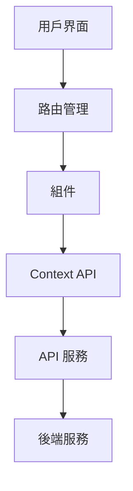
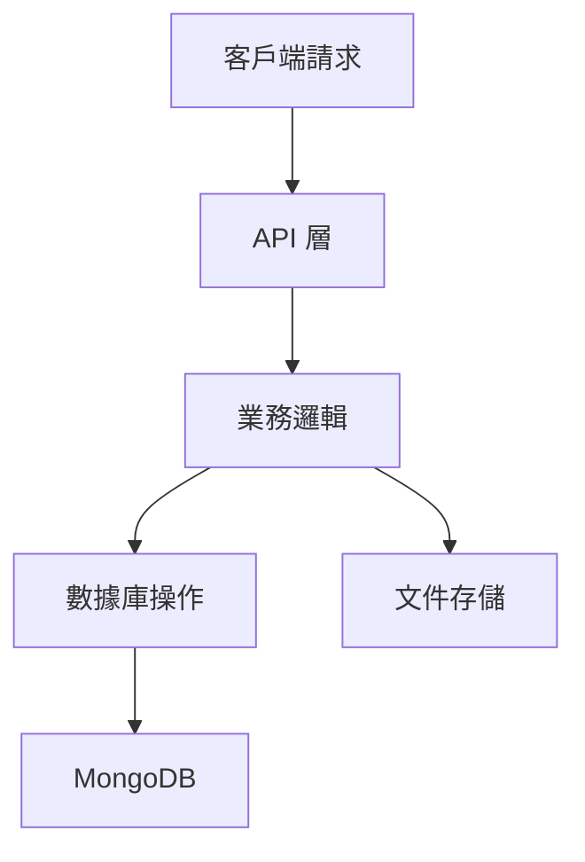

# Coffee Shop E-commerce Platform

## 專案簡介

一個整合電商與社群功能的咖啡豆購物平台，提供商家上架商品、會員購物及文章分享功能。

## 功能特點

- 會員系統：支持一般會員與商家會員
- 商品管理：商家可上架、編輯、下架商品
- 購物車系統：即時更新、數量管理
- 文章社群：會員可發布文章、互動交流
- 搜索功能：支持商品和文章的多維度搜索

## 技術架構

### 前端

- React 18
- Context API 狀態管理
- React Router v6
- Axios 請求處理
- CSS Modules 樣式管理

### 後端

- Node.js & Express
- MongoDB & Mongoose
- JWT 認證
- Multer 檔案上傳

## 本地開發

```bash
# 安裝依賴
npm install

# 啟動開發服務器
npm run dev

# 建置專案
npm run build
```

## 部署說明

1. 確保已安裝 Node.js 和 MongoDB。
2. 克隆專案到本地：
   ```bash
   git clone https://github.com/yourusername/coffeeshop-platform.git
   cd coffeeshop-platform
   ```
3. 安裝依賴：
   ```bash
   npm install
   ```
4. 配置環境變數：
   - 在專案根目錄下創建 `.env` 文件，並添加以下內容：
     ```
     MONGODB_URI=your_mongodb_uri
     PASSWORD_SECRET=your_jwt_secret
     ```
5. 啟動伺服器：
   ```bash
   npm run start
   ```

## 測試

```bash
# 運行單元測試
npm run test

# 運行 E2E 測試
npm run test:e2e
```

## API 文檔

API 文檔尚未完成。

## 系統架構

### 前端架構



### 後端架構



## 貢獻指南

歡迎貢獻！請遵循以下步驟:

1. Fork 本專案
2. 創建您的特性分支 (`git checkout -b feature/AmazingFeature`)
3. 提交您的更改 (`git commit -m 'Add some AmazingFeature'`)
4. 推送到分支 (`git push origin feature/AmazingFeature`)
5. 開啟 Pull Request

## 聯繫方式

如有任何問題，請聯繫 [linkuanhan8811@gmail.com](mailto:linkuanhan8811@gmail.com)。

## 授權

此專案採用 MIT 授權 - 詳見 [LICENSE](./LICENSE) 文件。
